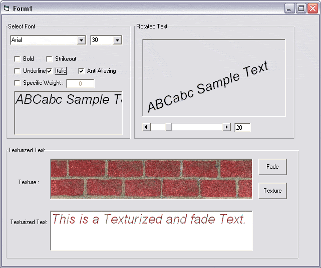



## Texturized text, fade Text, Rotated text

### Description

You can use API functions like TextOut and CreateFontIndirect to make font effects.

Your options are FontName, Height (same as size), Width , Weight (normal,bold and heavy black) , AntiAliasing, Rotating and . . .

you can see all options and samples in screenshot.
 
### More Info
 

             |
---                |---
**Submitted On**   |2002-07-26 14:57:42
**By**             |[ali s](https://github.com/Planet-Source-Code/PSCIndex/blob/master/ByAuthor/ali-s.md)
**Level**          |Intermediate
**User Rating**    |5.0 (35 globes from 7 users)
**Compatibility**  |VB 6\.0
**Category**       |[Graphics](https://github.com/Planet-Source-Code/PSCIndex/blob/master/ByCategory/graphics__1-46.md)
**World**          |[Visual Basic](https://github.com/Planet-Source-Code/PSCIndex/blob/master/ByWorld/visual-basic.md)
**Archive File**   |[Texturized1109737262002\.zip](https://github.com/Planet-Source-Code/ali-s-texturized-text-fade-text-rotated-text__1-37273/archive/master.zip)

